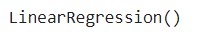

# Implementation-of-Simple-Linear-Regression-Model-for-Predicting-the-Marks-Scored

## AIM:
To write a program to predict the marks scored by a student using the simple linear regression model.

## Equipments Required:
1. Hardware – PCs
2. Anaconda – Python 3.7 Installation / Jupyter notebook

## Algorithm
1.Import the required libraries and read the dataframe.

2.Assign hours to X and scores to Y.

3.Implement training set and test set of the dataframe.

4.Plot the required graph both for test data and training data.

5.Find the values of MSE , MAE and RMSE. 

## Program:
```
/*
Program to implement the simple linear regression model for predicting the marks scored.
Developed by: M.Sowmya
RegisterNumber:  212221230107
*/
```
### implement simple linear reggression model to for predecting the marks shown
```
import numpy as np

import pandas as pd
dataset=pd.read_csv('student_scores.csv')
```
### assigning hours to X & scores to Y
```
x=dataset.iloc[:,:-1].values
y=dataset.iloc[:,1].values
print(x)
print(y)

from sklearn.model_selection import train_test_split
x_train,x_test,y_train,y_test=train_test_split(x,y,test_size=1/3,random_state=0)
from sklearn.linear_model import LinearRegression
reg=LinearRegression()
reg.fit(x_train,y_train)

y_pred=reg.predict(x_test)
y_pred
y_test
plt.scatter(x_train,y_train,color='red')
plt.plot(x_train,reg.predict(x_train),color="purple")
plt.title("h vs s (Training Set)")
plt.xlabel("Hours")
plt.ylabel("Scores")
plt.show()
plt.scatter(x_test,y_test,color='black')
plt.plot(x_test,reg.predict(x_test),color="orange")
plt.title("h vs s (Testing Set)")
plt.xlabel("Hours")
plt.ylabel("Scores")
plt.show()

from sklearn.metrics import mean_absolute_error, mean_squared_error
mse = mean_squared_error(y_test,y_pred)
print("MSE = ",mse)
mae=mean_absolute_error(y_test,y_pred)
print("MAE = ",mae)
rmse=np.sqrt(mse)
print("RMSE = ",rmse) 
```


## Output:





## Result:
Thus the program to implement the simple linear regression model for predicting the marks scored is written and verified using python programming.
